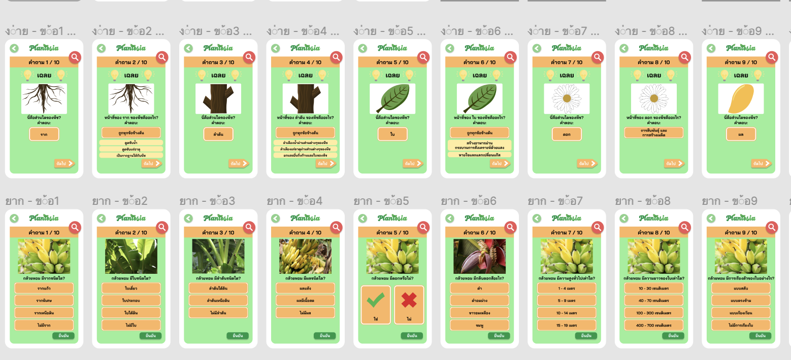
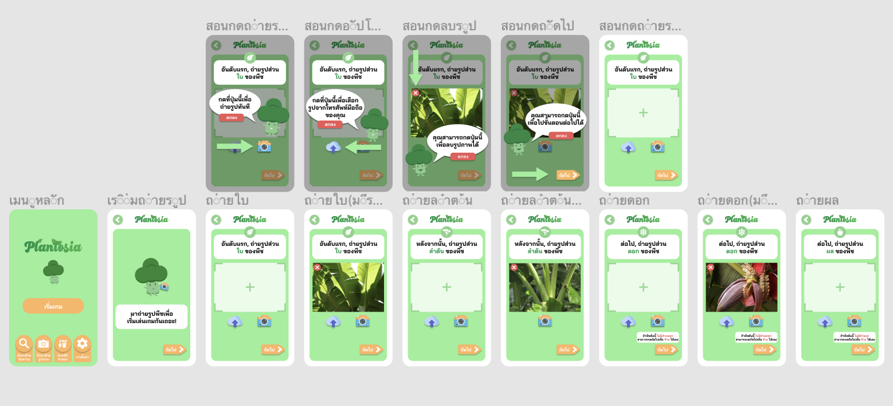

# plantosia-application

## Table of contents
* [General info](#general-info)
* [Preview](#Preview)
* [Technological-Stack](#Technological-Stack)
* [Setup](#Setup)


## General info

Plantosia is a project aimed to increase awareness of plantology for kids from age 7 - 12 years old. We deliver our solution in a form of c cross-platform application by React native





## Technological-Stack

### Front end
- React Native
- React Native Navigation
- Java script
- etc

### Dependencies
- axios
- expo
- python-shell
A simple way to run Python scripts from Node.js with basic but efficient inter-process communication and better error handling.
- react-native-responsive-dimensions
- material-ui

### Backend
- Node.js
- Express.js
- Postgresql

### Object Detection

- YOLOv3 Algorithm
- Darknet 53


## Preview
# ffwefwef


## Setup

```
x. install Xcode ( If you want to run IOS version)
-  download via App store ( Mac)
### Only Applicable for Macbook, Imac or apple computer
x. install android studio 
- https://developer.android.com/studio
### Viable for both Mac and PC (Window)
x. install postresql
- https://www.postgresql.org/docs/
x. open cmd (Window) or terminal( MacOS)
x. navigate to XXX/plantosia-application_updated
1. npm install 
2. npm install --global yarn
x. Adding Plant's info into our postgresql database
  1. start postgres server by  executing command 'postgres sql' in the cmd or terminal
  2. create 'plantosia' database in postgres server by executing sql queries from all the files in plantosia-application-updated/postgresql/
by the following orders
    1. PlantosiaDB_Creation.sql
    2. PlantosiaDB_Delete.sql
    3. PlantosiaDB_Insertion.sql
    4. PlantosiaDB_Insertion_Thai.sql
  ### Copy all the queries in each file and place them in cmd or terminal then press 'enter', do this for all the .sql files
x. navigate to XXX/plantosia-application_updated/backend
x. npx nodemon server.js
x. navigate back to XXX/plantosia-application_updated
x. expo start
After executing a command 'expo start', the expo page will pop up in your browser, you can choose how you want to run your application web/ android/ ios there.


## Basic postresql command
To start postgres, you use  psql postgres command in cmd or terminal
To list all databases in the current PostgreSQL database server, you use \l command:
To list all tables in the current database, you use \dt command:
To access a particular database, you use the floowing command : \c table_name
To describe a table such as a column, type, modifiers of columns, etc., you use the following command: \d table_name

Ref
- https://www.postgresqltutorial.com/psql-commands/
- https://dataschool.com/learn-sql/how-to-start-a-postgresql-server-on-mac-os-x/

```


## Design 
- https://www.figma.com/file/ZzJtqs8sTwwyikK7MYw1Hs/Plant-Ontology-Interface?node-id=0%3A1

=======

